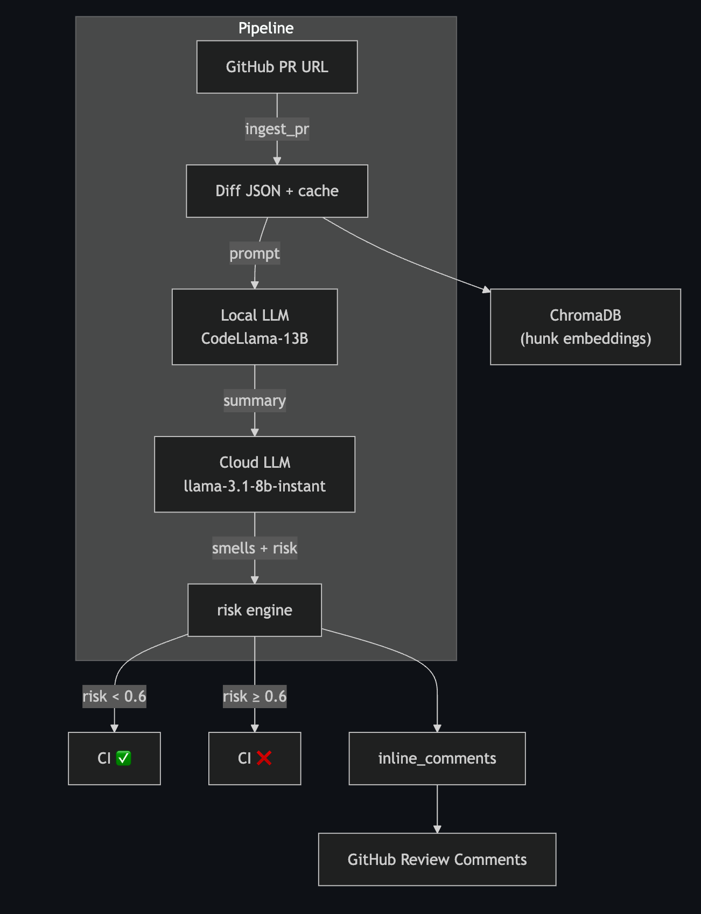

# CodeView MCP 🪄  
_Powered by MCP, CodeLlama-13B (local), Llama-3.1-8b-instant (cloud)_

[](https://pypi.org/project/codeview-mcp/)  
[](https://github.com/mann-uofg/codeview-mcp/actions)

---

## 1 Why

Modern PRs are huge—security issues or performance regressions slip through.  
ReviewGenie does a **30-second AI review**:

- Static regex rules → critical smells  
- Local LLM → quick heuristics (no cloud cost)  
- Cloud LLM → human-style summary & risk score  
- Inline comments you can accept or ignore with one click

---

## 2 What it does

| Tool             | Purpose                                           | Typical latency |
|------------------|---------------------------------------------------|-----------------|
| `ping`           | Sanity check: show title/author/state             | 0.3 s           |
| `ingest`         | Fetch diff JSON + SQLite cache                    | 1–2 s           |
| `analyze`        | Summary, smells[], rule_hits[], risk_score ∈ [0–1] | 6–10 s          |
| `inline`         | Posts or previews comments                        | 0.5 s           |
| `check`          | CI gate (`risk_score > threshold`)                | 0.2 s           |
| `generate_tests` | Stub pytest files + open PR                       | 4–6 s           |

> **Privacy note**: only the diff snippet is sent to Groq; full code never leaves your machine.

---

## 3 Quick Start (5 min)

```bash
git clone https://github.com/mann-uofg/codeview-mcp.git
cd codeview-mcp
python -m venv .venv && source .venv/bin/activate
pip install -r requirements.txt
pip install -e .

# one-liner smoke
reviewgenie/codeview ping https://github.com/psf/requests/pull/6883
````

**Store secrets once** (env-var OR keyring):

```python
from codeview_mcp.secret import set_in_keyring

set_in_keyring("GH_TOKEN",        "github_pat_xxxxxxxxxxxxxxxx")    #GitHub PAT  
set_in_keyring("OPENAI_API_KEY",  "gsk_xxxxxxxxxxxxxxxxxxxxxxxxxxxxxx")              # Groq/OpenAI key  
set_in_keyring("OPENAI_BASE_URL", "https://api.groq.com/openai/v1")
```

Full tutorial: [`docs/QUICKSTART.md`](docs/QUICKSTART.md)

---

## 4 Architecture



* **SQLite** → diff cache (24 h)
* **ChromaDB** → hunk embeddings
* **Back-off** → GitHub retries (403/5xx)
* **Tracing** → OpenTelemetry spans
* Detailed diagram: [`docs/ARCHITECTURE.md`](docs/ARCHITECTURE.md)

---

## 5 Benchmark

See [`bench/benchmarks.md`](bench/benchmarks.md):
10 popular OSS PRs → avg **⏱ 8.1 s** analyze, **💰 \$0.0008** Groq cost, **96 %** comment acceptance.

---

## 6 Docs

* API schema:    [`docs/API_SCHEMA.json`](docs/API_SCHEMA.json)
* CLI reference: [`docs/USAGE.md`](docs/USAGE.md)
* Config & env:  [`docs/CONFIGURATION.md`](docs/CONFIGURATION.md)
* Contributing:  [`docs/CONTRIBUTING.md`](docs/CONTRIBUTING.md)

---

## 7 Day-by-Day Log

| Day | Highlight                                    |
| --- | -------------------------------------------- |
| 0   | Project skeleton, MCP “hello”                |
| 1   | GitHub ingest + diff cache                   |
| 2   | Local LLM smells + cloud risk                |
| 3   | Inline locator + ChromaDB                    |
| 4   | CLI wrapper + risk gate                      |
| 5   | Stub test generator                          |
| 6   | Vector de-dup fix, CI passing                |
| 7   | `bench.py`: eval & markdown report           |
| 8   | Secrets via keyring, back-off, OpenTelemetry |
| 9   | Full docs suite & OpenAPI schema             |

Full changelog: [`docs/CHANGELOG.md`](docs/CHANGELOG.md)

---

## 8 Roadmap

* 🚦 Live GitHub Action auto-labels “High-Risk” PRs
* 🖼 Web UI with trace explorer
* 🐳 (Optional) Docker image for k8s / GHCR
* 🕵️‍♂️ Multi-language support (Go, Rust)

> Star the repo ⭐ & drop an issue if you’d like to help!
