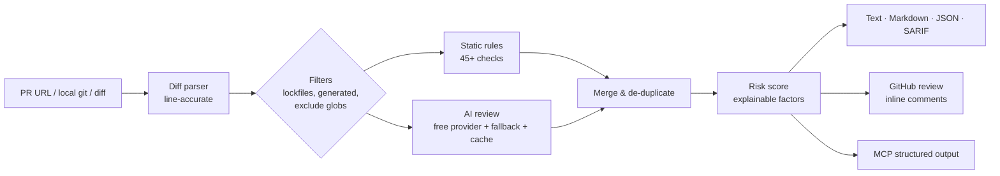

<div align="center">

# 🧞 ReviewGenie

**AI code review for pull requests and local changes. An MCP server, a CLI and a GitHub Action, running entirely on free models.**

[](https://pypi.org/project/reviewgenie/)
[](https://pypi.org/project/reviewgenie/)
[](https://github.com/mann-uofg/codeview-mcp/actions/workflows/ci.yml)
[](LICENSE)
[](https://modelcontextprotocol.io)

</div>

```text
$ uvx reviewgenie review https://github.com/acme/api/pull/42

🧞 ReviewGenie · https://github.com/acme/api/pull/42
⛔ Changes requested · Risk 🟠 58/100 (high) · 6 files · +212/-40

Adds a user search endpoint. The query is assembled with an f-string, which allows SQL injection,
and the new handler swallows database errors. Tests cover the happy path only.

 🔴  SQL built from strings            api/users.py:88        RG-SEC-025
 🔴  Unvalidated sort column           api/users.py:91        AI
 🟠  Error silently swallowed          api/users.py:104       AI
 🟡  No test for empty search term     tests/test_users.py    AI
```

## Why ReviewGenie

- **Zero cost.** Uses free API tiers (Gemini, Groq, Cerebras, OpenRouter) or a local Ollama model. No keys at all? You still get 45+ deterministic security and bug rules.
- **Built for MCP.** Your assistant can review a PR, review your uncommitted work before you push, pull a line-numbered diff for its own reasoning, and publish the review, all with structured outputs.
- **Two brains.** Fast regex rules catch secrets, injection, unsafe deserialization, TLS bypasses and CI/CD supply-chain issues deterministically. The AI pass catches logic bugs, edge cases and missing tests. Results are merged and de-duplicated.
- **Explainable risk.** A 0-100 score built from visible factors: size, sensitive areas (auth, payments, migrations, CI), findings, missing tests, plus the AI's assessment.
- **Everywhere you work.** MCP (stdio or HTTP), a terminal CLI, a GitHub Action with inline review comments, SARIF for GitHub code scanning, Markdown, and JSON.
- **Secure by design.** Hardened against prompt injection, hostile repositories and SSRF (see [Security model](#security-model)).

## Quick start

```bash
# No install needed (uv), or: pipx install reviewgenie / pip install reviewgenie
uvx reviewgenie review https://github.com/psf/requests/pull/6883   # public PR, no token needed
uvx reviewgenie review                                             # your uncommitted changes
uvx reviewgenie review --staged                                    # just what's staged
uvx reviewgenie review --branch                                    # this branch vs main
```

Turn on the AI pass with a **free** key. Any one of these works, and if several are set they're tried in order as fallbacks:

| Provider | Free key | Environment variable |
|---|---|---|
| Google Gemini (recommended) | [aistudio.google.com/apikey](https://aistudio.google.com/apikey) | `GEMINI_API_KEY` |
| Groq | [console.groq.com/keys](https://console.groq.com/keys) | `GROQ_API_KEY` |
| Cerebras | [cloud.cerebras.ai](https://cloud.cerebras.ai) | `CEREBRAS_API_KEY` |
| OpenRouter (free models) | [openrouter.ai/keys](https://openrouter.ai/keys) | `OPENROUTER_API_KEY` |
| Ollama (local, offline) | [ollama.com](https://ollama.com/download) | `RG_OLLAMA=1` (or `OLLAMA_HOST`) |
| Any OpenAI-compatible server | – | `RG_BASE_URL`, `RG_MODEL`, `RG_API_KEY` |

```bash
export GEMINI_API_KEY=...        # PowerShell: $env:GEMINI_API_KEY="..."
reviewgenie providers            # shows what's configured and the model each provider will use
```

Each provider ships with a sensible free-tier default model. Override it with `--model`, `RG_MODEL` or `model =` in the config. Private repositories and posting reviews need `GITHUB_TOKEN` (or just `gh auth login`, which ReviewGenie picks up automatically).

## Use it from your AI assistant (MCP)

Add ReviewGenie to any MCP-compatible client (VS Code, Cursor, Windsurf, Zed, and others):

```json
{
  "mcpServers": {
    "reviewgenie": {
      "command": "uvx",
      "args": ["reviewgenie", "serve"],
      "env": { "GEMINI_API_KEY": "your-free-key", "GITHUB_TOKEN": "optional" }
    }
  }
}
```

<details><summary>VS Code (<code>.vscode/mcp.json</code>)</summary>

```json
{
  "servers": {
    "reviewgenie": { "type": "stdio", "command": "uvx", "args": ["reviewgenie", "serve"] }
  }
}
```
</details>

<details><summary>Remote / HTTP transport</summary>

```bash
reviewgenie serve --http --port 8765     # Streamable HTTP at http://127.0.0.1:8765/mcp
```
It binds to localhost with DNS-rebinding protection. If you expose it beyond localhost, put it behind an authenticating proxy.
</details>

Then just ask: *"Review PR acme/api#42"*, *"Review my changes before I commit"*, *"Do a security audit of this PR"*.

| Tool | What it does |
|---|---|
| `review_pull_request` | Full review of a GitHub PR: findings, 0-100 risk, verdict. Read-only. |
| `review_local_changes` | Review working-tree, staged or branch changes in a local repo. |
| `review_diff_text` | Review any unified diff. |
| `get_pull_request_diff` | PR metadata + line-numbered diff, so the assistant can do its own deep review. |
| `post_review` | Publish one GitHub review with inline comments. **Dry run by default**; re-runs never duplicate comments. |
| `list_rules` / `provider_status` | Inspect the static rules and which free providers are configured. |

**Prompts:** `deep_review`, `security_audit`, `suggest_tests`, `review_my_changes`. **Resources:** `reviewgenie://rules`, `reviewgenie://providers`, `reviewgenie://config/example`.

## GitHub Action: free AI reviews on every PR

```yaml
# .github/workflows/review.yml
name: ReviewGenie
on:
  pull_request:
permissions:
  contents: read
  pull-requests: write      # post the review
  security-events: write    # optional: SARIF → code scanning
jobs:
  review:
    runs-on: ubuntu-latest
    steps:
      - uses: actions/checkout@v7
      - uses: mann-uofg/codeview-mcp@v2
        id: genie
        with:
          gemini-api-key: ${{ secrets.GEMINI_API_KEY }}   # optional; static rules run without it
          fail-on: critical                               # or high / medium / never
      - uses: github/codeql-action/upload-sarif@v4
        if: always()
        with:
          sarif_file: reviewgenie.sarif
```

You get a summary review with a risk breakdown, inline comments on the exact lines, a job summary, SARIF alerts in the Security tab, and outputs (`risk-score`, `risk-level`, `verdict`, `findings`) for later steps. Configuration is always read from the PR's **base** branch, so a pull request can't switch off its own review.

## CLI reference

```bash
reviewgenie review [PR_URL | OWNER/REPO#N]      # omit the target to review local changes
  --staged | --branch [--base main] | --diff FILE|-  # choose what to review
  -f text|markdown|json|sarif  -o FILE          # output format and file
  --json-output FILE --sarif-output FILE        # extra report files in the same run
  --post [--dry-run]                            # publish to the PR (inline comments)
  --fail-on high   --max-risk 60                # CI gates (exit code 1)
  --provider gemini --model ... --focus security --no-ai --no-cache
reviewgenie serve [--http]                      # MCP server
reviewgenie providers | rules | init | mcp-config | clear-cache
```

## Configuration

`reviewgenie init` writes a commented `.reviewgenie.toml`. Settings can also live under `[tool.reviewgenie]` in `pyproject.toml`.

```toml
provider = "auto"            # auto | gemini | groq | cerebras | openrouter | ollama | openai-compatible | none
min_severity = "low"         # drop findings below this level
fail_on = "high"             # CLI exit code 1 at/above this severity ("never" to disable)
max_findings = 30
exclude = ["docs/**", "**/*.generated.ts"]
disable_rules = ["RG-QUAL-006"]
focus = ["security", "performance"]
instructions = "We use SQLAlchemy 2.x; flag raw SQL built with string formatting."

[[custom_rules]]
id = "TEAM-001"
pattern = "print\\("
message = "Use the structured logger instead of print()."
severity = "low"
paths = ["src/**/*.py"]
```

Silence a single line with a trailing `reviewgenie-ignore` or `rg-ignore[RG-SEC-020]` comment.

## What it checks

`reviewgenie rules` lists every rule. Highlights:

- **Secrets:** AWS, GitHub, Slack, Stripe, Google and AI-provider keys; private keys; JWTs; hard-coded passwords; credentials in URLs. Values are always redacted in output.
- **Injection:** SQL built from strings, `eval`/`exec`, `shell=True`, command execution, XSS sinks, disabled auto-escaping, path traversal, SSRF.
- **Crypto & transport:** disabled TLS verification, MD5/SHA-1, insecure randomness for tokens.
- **Supply chain:** `pull_request_target`, script injection via `${{ github.event.* }}`, actions pinned to branches, `write-all` permissions, unpinned base images, `curl | sh`.
- **Bugs & leftovers:** bare/empty `except`/`catch`, mutable defaults, `== None`, debugger statements, `.only` tests, `any`/`@ts-ignore`, unchecked `.unwrap()`, ignored Go errors.

## How it works


```mermaid
flowchart LR
    A[PR URL / local git / diff] --> B[Diff parser<br/>line-accurate]
    B --> C{Filters<br/>lockfiles, generated,<br/>exclude globs}
    C --> D[Static rules<br/>45+ checks]
    C --> E[AI review<br/>free provider + fallback + cache]
    D --> F[Merge & de-duplicate]
    E --> F
    F --> G[Risk score<br/>explainable factors]
    G --> H[Text · Markdown · JSON · SARIF]
    G --> I[GitHub review<br/>inline comments]
    G --> J[MCP structured output]
```

AI responses are cached locally (keyed by diff, prompt and model) so re-reviewing the same change costs nothing. Diffs are trimmed to each provider's free-tier budget, smallest source files first.

## Security model

ReviewGenie processes untrusted input: diffs and PR text written by anyone, and output from language models. So:

- **Prompt injection:** diff, title and description are fenced as data, and the model is told never to follow instructions inside them. Model output is schema-validated, and findings must point at files and lines that exist in the diff; anything else is dropped or unanchored.
- **Safe publishing:** generated text has `@mentions`, `closes #N` keywords, remote images and hidden HTML markers neutralised before it's posted to GitHub.
- **Hostile repositories:** local git runs with external diff drivers, textconv filters, fsmonitor hooks and pagers disabled; refs are validated (no option injection); untracked symlinks are never followed.
- **SSRF / token safety:** only PR URLs on the configured GitHub host are accepted, the token is never sent elsewhere, and API keys are never sent over plain HTTP to non-local hosts.
- **Config integrity:** PR reviews read configuration from the base branch, not from the PR.
- **Least privilege:** MCP tools carry read-only/destructive hints; `post_review` defaults to a dry run; the HTTP transport binds to localhost with DNS-rebinding protection.

Found a vulnerability? See [SECURITY.md](SECURITY.md).

## Development

```bash
git clone https://github.com/mann-uofg/codeview-mcp && cd codeview-mcp
uv sync                 # or: python -m venv .venv && pip install -e . --group dev
uv run pytest           # 190+ tests, network fully mocked
uv run ruff check . && uv run mypy
```

See [CONTRIBUTING.md](CONTRIBUTING.md) and the [changelog](CHANGELOG.md). Upgrading from 1.x (`reviewgenie-mcp`)? The package is now `reviewgenie`; see the changelog for the migration notes.

## License

MIT © Mann Modi
